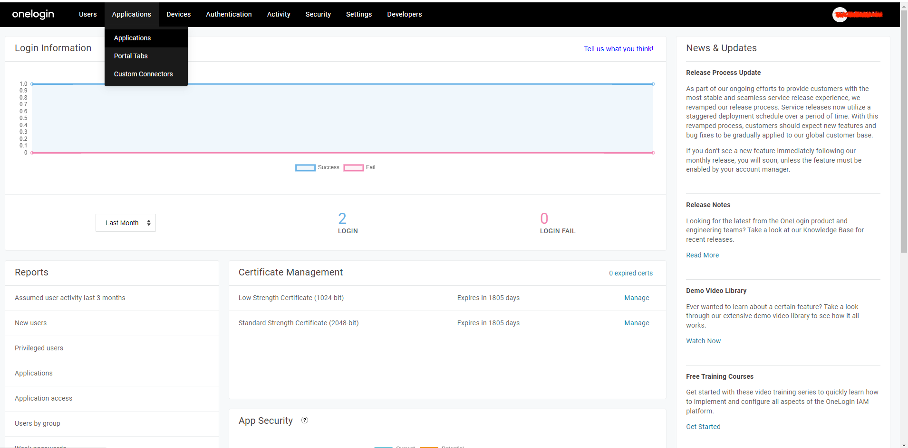
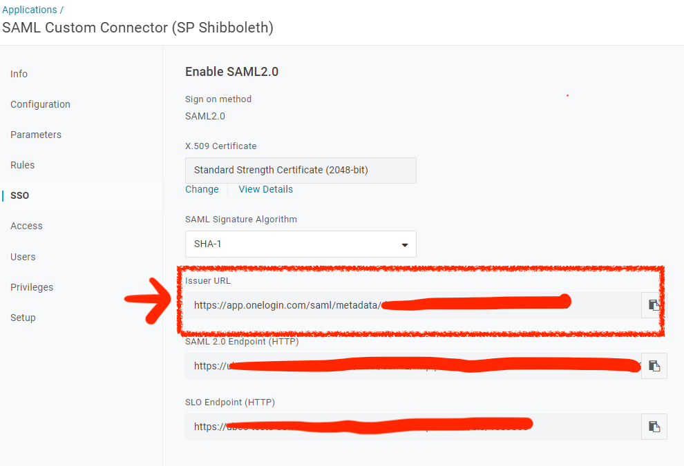

# Authentication Architecture
<hr>

The diagram below was taken from the [**Developer Guide of AWS Cognito service**](https://docs.aws.amazon.com/cognito/latest/developerguide/cognito-user-pools-saml-idp-authentication.html)

Through a hostedUI provided by Cognito, the app can handle all the 
sign-in,sign-out requests and as well as getting all the attributes associated to the user from the external idp

<hr>

## How to combine Cognito User pool with SAML Identity Provider
We will be focusing on the following:
 - How to create a SAML Identity Provider using OneLogin
 - How to setup the Cognito User Pool with SAML Identity Provider
 - How to configure the SAML Identity Provider to use the Cognito User Pool


Once the deployment of the backend and frontend of this app is finished, please head to
[**Cognito**](https://console.aws.amazon.com/cognito/home)

### Access User Pools
1. Click on 'Manage User Pools'
   
2. Select the User Pool which the student app is using
   

### Setup OneLogin for SAML

1. Go to [Onelogin](https://www.onelogin.com/developer-signup) and sign in
   

2. Once logged in go to applicatoions and click on 'Create Application'
   

3.  Click on `Add App` and from the next page seearch for `Shibboleth`
   

4. Add details for the application
   

5. Once setup is complete we will be able to see the SSO credetilas under the SSO tab
   

Note: The Issuer URL is the Url highlighted in the above image

### SAML Provider Setup
1. Click on 'Identity Providers' on the panel from the left side
   

2. Enter a descriptive name for your SAML provider
      and make sure checkbox 'Enable IdP sign out flow' is checked
   
3. Fill in the IDP metadata link or upload it
   


4. Once everything filled, click onto 'Create Provider'

### Attributes Creation

1. Now, we need to create the attributes that you are going to capture from your external idp in Cognito.
   Click on 'Attributes' on the panel from the left side
   
2. Click onto 'Add another attribute' to add all the attributes that you want to get from your external idp. Once you are done,
click on 'save changes'.
   

### Attributes Mapping
1. Click onto 'Attributes Mapping'
2. In the dropdown menu, make sure to select the SAML provider that you have just created
   In our case, the SAML provider name called 'MySamlProvider'
   
3. Click on 'Add SAML Attribute' to add a new attribute.
   Make sure the SAML attribute name is the same as the one in the external IDP
   
4. Once you are done, save you changes

### App Client Setup

1. Click on 'App Clients' on the panel from the left side
   
2. Scroll down to the page and select 'Add another App client'
3. Make sure to uncheck 'Generate Client Secret' and feel free to leave all other settings as default
   
4. Scroll down and expand 'Set attribute read and write permissions'
   
   
5. Make sure all the attributes that you would like to receive in your app are checked on both sides
   
   
6. Once you are done, hit 'Create App Client'

7. Now, you should see your new app client and there is an App client id associated to it. Take a note of the id.


### App Client Settings

1. Go to App Client Settings
   
2. Check your identity providers under 'Enabled Identity Providers'
3. Give the Sign in and Sign out URLs. Only uses localhost for development purposes
   
4. Select the following options in OAuth Flows (checking implicit grant means you will receive a jwttoken (includes all user attributes in the call back uri when user logs in successfully))


### Hosted UI setup
We need to configure a hosted UI (provided by Cognito) for the user to sign-in/out 

First, let's create a domain name for the hosted UI
1. Go to Domain name on the left panel

   
2. You can use your own domain or use Cognito's domain for accessing the hosted ui
   
   
3. Now, you can go back to "App Client Settings" and click 'Launch Hosted UI' to test log in/log out
   


4. Now back to Onelogin SAML Connector App navigate to the “Configuration” tab. There’s a few fields here and here’s what the values should be
- “Relay State”: This is the page where your user should be directed to upon successful log in. This is the same as the “Sign in” URL from Cognito’s App client settings.
- “Audience”: The audience value looks like this urn:amazon:cognito:sp: <cognito_user_pool_id>. You can grab the Cognito User Pool ID from the Cognito console.
- “ACS (Consumer) URL Validator*” and “ACS (Consumer) URL*”: This two fields should contain the same URL which looks like the domain you setup in Cognito in the previous step — https://<your_domain_name>.auth.us-east-1.amazoncognito.com/login.
- “Single Logout URL”: This is the Sign out URL where your users should be redirected to upon successful signout. Again, this should match with what you have set up in Cognito’s “Sign out” URL.


Congratulations, now you have finished setting up Cognito with SAML Identity Provider.

### Modifications to code

In order to make the app work with the SAML Identity Provider, we need to make some modifications to the code.

First, we need to uncomment the 334-342 lines in the [`Survey.js`](src\views\Survey\Survey.js) file:

``` javascript
function createUserData(user){
         let userData ={
             //id: user.attributes.email,
             id: user.attributes['custom:SP-PUID'],
             SPUID: user.attributes['custom:SP-PUID'],
             displayName: user.attributes['custom:preferredGivenName'],
             yearLevel: user.attributes['custom:studentYearLevel'],
             email:user.attributes['custom:studentLearnerEmail'],
             primarySpecialization: user.attributes['custom:specPrimPrgmType'],
             campus: user.attributes['custom:locale'],
             faculty:user.attributes['custom:adwardingFaculty'],
             gender: gender,
             cisOrTrans:cisOrTrans
         }
```

Next inorder to setup the Custom Attribute mapping uncomment the lines 956- 982 in [`template.yml`](template.yaml)

``` yaml
CognitoApplicationClient:
    Type: "AWS::Cognito::UserPoolClient"
    Properties:
      ClientName: !Sub '${AWS::StackName}-appclient'
      GenerateSecret: false
      RefreshTokenValidity: 2
      UserPoolId: !Ref CognitoUserPool
      WriteAttributes:
        - email
        - "custom:SP-PUID"
        - "custom:preferredGivenName"
        - "custom:studentYearLevel"
        - "custom:studentLearnerEmail"
        - "custom:specPrimPrgmType"
        - "custom:locale"
        - "custom:adwardingFaculty"

  CognitoUserPoolIdP:
    Type: AWS::Cognito::UserPoolIdentityProvider 
    Properties:
      UserPoolId: !Ref CognitoUserPool
      ProviderName: "CWL"
      ProviderType: "SAML"
      ProviderDetails:
        MetadataURL: "https://app.onelogin.com/saml/metadata/d1bba37d-897e-4e83-a9ed-846811996799"
      AttributeMapping:
        custom:preferredGivenName: "displayName"
        custom:studentYearLevel: "yearLevel"
        custom:studentLearnerEmail: "email"
        custom:specPrimPrgmType: "primarySpecialization"
        custom:locale: "campus"
        custom:adwardingFaculty: "faculty"
        custom:SP-PUID: "id"
```

The metadata URL is the metadata link that you have provided in the SAML provider setup. The URL above is for the CWL SAML provider and it has been setup with the attributes that you want to capture from the external IDP.

<hr>
