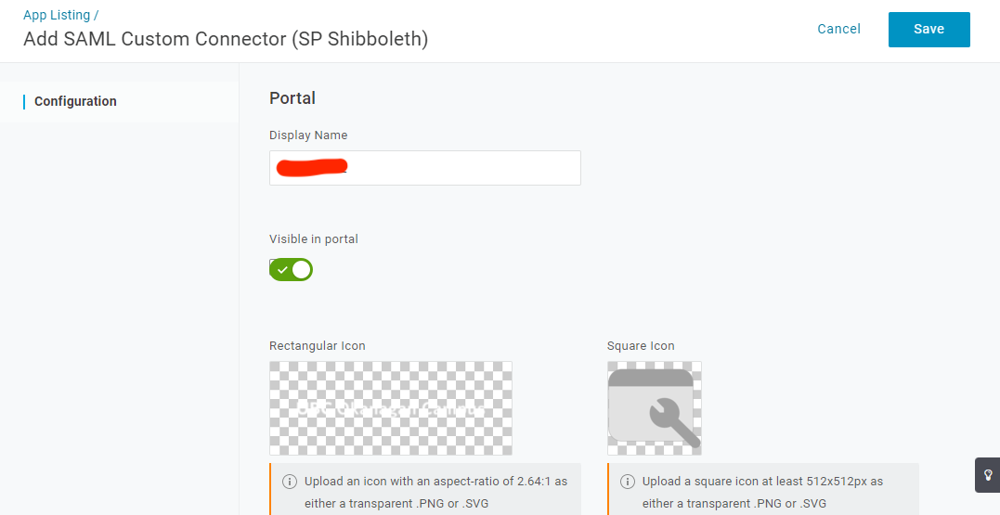
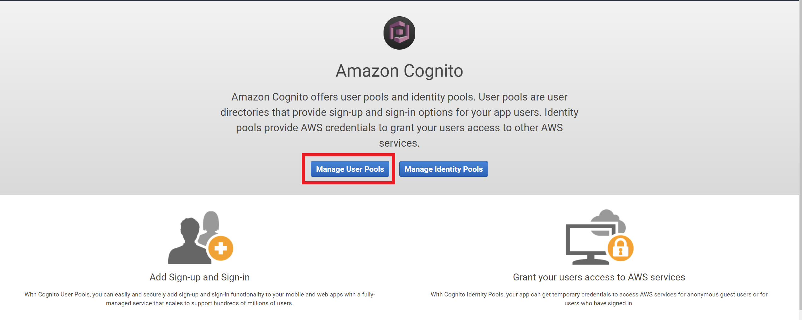
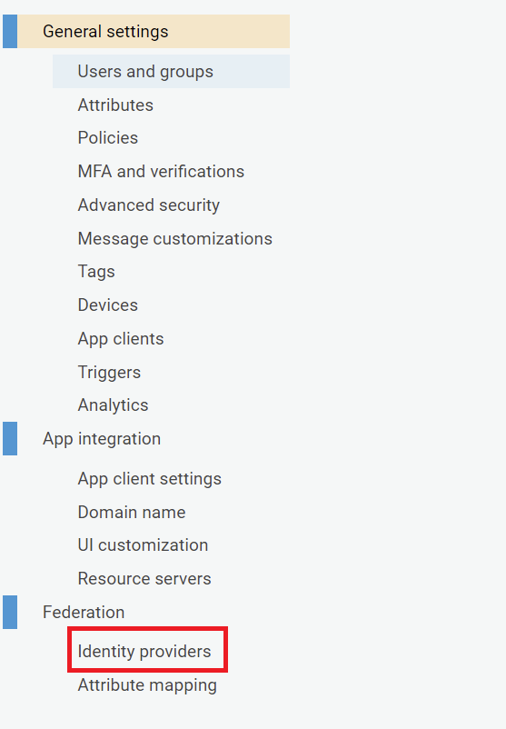
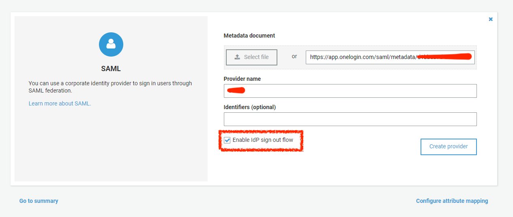
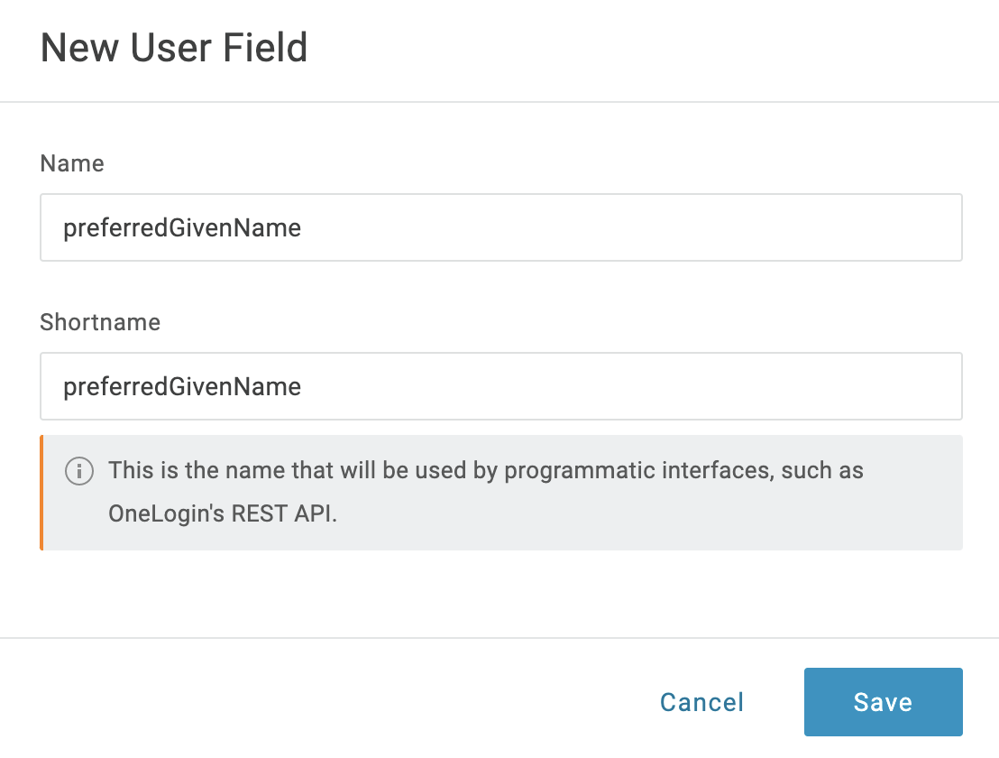
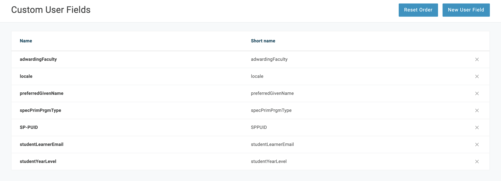
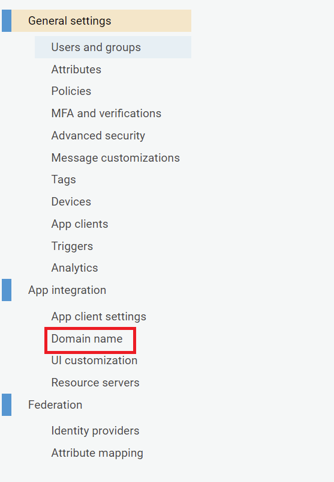
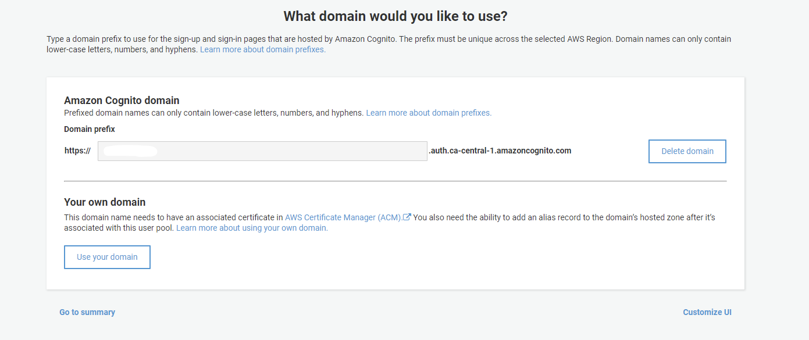

# Authentication Architecture

The diagram below was taken from the [**Developer Guide of AWS Cognito service**](https://docs.aws.amazon.com/cognito/latest/developerguide/cognito-user-pools-saml-idp-authentication.html)

Through a hostedUI provided by Cognito, the app can handle all the 
sign-in,sign-out requests and as well as getting all the attributes associated to the user from the external idp

<hr>

## How to combine Cognito User pool with SAML Identity Provider
We will be focusing on the following:
 - How to create a SAML Identity Provider using OneLogin
 - How to setup the Cognito User Pool with SAML Identity Provider
 - How to configure the SAML Identity Provider to use the Cognito User Pool


Once the deployment of the backend and frontend of this app is finished, please follow the following steps.

### 1. Setup OneLogin for SAML

1.1) Go to [Onelogin](https://www.onelogin.com/developer-signup) and sign in, or sign up for an account if you don't have one

1.2) Once logged in go to applications and click on 'Application'
   

1.3)  Click on `Add App`. From the next page search for `Shibboleth` and select `SAML Custom Connector (SP Shibboleth)`
   

1.4) Add details for the application
   

1.5) Once setup is complete we will be able to see the SSO credentials under the SSO tab
   

Note the Issuer URL, we will need it in later steps.

<hr>

### 2. Access User Pools
2.1) From Amazon [**Cognito**](https://console.aws.amazon.com/cognito/home), click on 'Manage User Pools'
   

2.2) Select the User Pool which the student app is using
   
 
<hr>

### 3. SAML Provider Setup
3.1) Click on 'Identity Providers' on the panel from the left side
   

3.2) Enter a descriptive name for your SAML provider and make sure checkbox 'Enable IdP sign out flow' is checked
   
3.3) Fill in the IDP metadata link, i.e. the Issuer URL from step 1.5, or upload it
   


3.4) Once everything filled, click onto 'Create Provider'

<hr>

### ***Attributes Creation and Mapping***
In the next step, we will create and map the custom attributes and create the app client that will be needed for the external IDP. We will first set up the attributes on the SAML provider ([Section 4](#4-adding-custom-attributes-in-saml-provider)), then on Cognito ([Section 5~8](#5-automatic-attribute-mapping-using-cloudformation)).

<hr>

### 4. Adding Custom Attributes in SAML provider

4.1) Go to [Onelogin](https://www.onelogin.com/developer-signup) and sign in

4.2) Go to **Users** -> **Custom User Fields** -> **New User Field**


4.3) Enter the **Name** and **Shortname** for the new custom user field, click on **Save**


4.4) Repeat and add all the custom user field needed


4.5) On the upper tab, click on **Applications** -> **Applications**, select the application that you have created

4.6) Under **Parameters** on the left side of the screen, click on the plus button to add new parameters


4.7) Enter the **name**, click on **Save**, and select the value for this parameter. If you do not see the value you want, follow step 4.2~4.3

4.8) Repeat until all parameters are added

<hr>

### ***Attributes Creation and Mapping on Cognito***
For attributes creation and mapping on Cognito, you can either 
- redeploy the `template.yaml` file which will automatically create and map the attributes for you to Cognito using cloudformation (**[Section 5](#5-automatic-attribute-mapping-using-cloudformation)**), or
- manually add them in the Cognito UI Console (**[Section 6~8](#6-attributes-creation-on-cognito-ui-console)**)
###

<hr>

### 5. Automatic attribute mapping using cloudformation

5.1) In order to setup the Custom Attribute mapping uncomment the lines 947-961 and 972-997 in [`template.yaml`](../template.yaml)

``` yaml
CognitoUserPool:
    Type: "AWS::Cognito::UserPoolClient"
    Properties:
    ...
    ## Uncomment the schema below to enable SAML integration
      Schema:
        - AttributeDataType: String
          Name: SP-PUID
        - AttributeDataType: String
          Name: preferredGivenName
        - AttributeDataType: Number
          Name: studentYearLevel
        - AttributeDataType: String
          Name: studentLearnerEmail
        - AttributeDataType: String
          Name: specPrimPrgmType
        - AttributeDataType: String
          Name: locale
        - AttributeDataType: String
          Name: adwardingFaculty

## Uncomment the WriteAttributes and CognitoUserPoolIdP to enable SAML integration

  CognitoApplicationClient:
    Type: "AWS::Cognito::UserPoolClient"
    Properties:
      ...
      WriteAttributes:
        - email
        - "custom:SP-PUID"
        - "custom:preferredGivenName"
        - "custom:studentYearLevel"
        - "custom:studentLearnerEmail"
        - "custom:specPrimPrgmType"
        - "custom:locale"
        - "custom:adwardingFaculty"

  CognitoUserPoolIdP:
    Type: AWS::Cognito::UserPoolIdentityProvider 
    Properties:
      UserPoolId: !Ref CognitoUserPool
      ProviderName: "CWL"
      ProviderType: "SAML"
      ProviderDetails:
        MetadataURL: "issuer_URL" # replace with the issuer URL
      AttributeMapping:
        custom:preferredGivenName: "displayName"
        custom:studentYearLevel: "yearLevel"
        custom:studentLearnerEmail: "email"
        custom:specPrimPrgmType: "primarySpecialization"
        custom:locale: "campus"
        custom:adwardingFaculty: "faculty"
        custom:SP-PUID: "id"
```
5.2) The metadata URL is the metadata link that you have provided in the SAML provider setup. The URL above is for the CWL SAML provider and it has been setup with the attributes that you want to capture from the external IDP. Replace `issuer_URL` with the issuer URL (see step 1.5).

5.3) Add or remove the attributes that you would like to include in your app. For custom WriteAttributes under the `CognitoApplicationClient`, make sure they are also included in the `CognitoUserPool`'s `Schema`.

5.4) Open the terminal at the root folder of the repository, and then run the deployment script using the following command using
   your own parameter values inside the angle brackets. The order of arguments must be the same as shown.

   For Mac, Linux and Windows Subsystem for Linux users:

   ```   
   chmod +x deploy.sh
   ./deploy.sh --aws-profile <AWS_PROFILE> --aws-region <AWS_REGION> --stack-name <STACK_NAME>
   ```

   For Windows users:
   ```   
   deploy.bat aws-profile:<AWS_PROFILE> aws-region:<AWS_REGION> stack-name:<STACK_NAME>
   ```

See **Step 1** in [`Deployment Guide`](DeploymentGuide.md) for more details on the parameters.

5.5) If successfully deployed, you can go on Cognito Console. Under **General Settings** -> **Attributes**, you can see that the attributes have been successfully added.

You can skip to **[Section 9](#9-app-client-settings)**.


<hr>

### 6. Attributes Creation on Cognito UI Console

6.1) Now, we need to create the attributes that you are going to capture from your external idp in **Cognito**.
   Click on 'Attributes' on the panel from the left side
   

6.2) On the right, under **Do you want to add custom attributes?**, click onto '**Add another attribute**' to add all the attributes that you want to get from your external idp. Once you are done,
click on '**Save changes**'.
   

### 7. Attributes Mapping on Cognito UI Console
7.1) Under **Federation**, click onto '**Attributes Mapping**'

7.2) In the dropdown menu, make sure to select the SAML provider that you have just created.
   

7.3) Click on '**Add SAML Attribute**' to add a new attribute.
   Make sure the SAML attribute name is the same as the one in the external IDP
   

7.4) Once you are done, save you changes

7.5) Make sure to have the same attributes in your SAML provider and Cognito User Pool
   

<hr>

### 8. App Client Setup on Cognito UI Console

8.1) Click on 'App Clients' on the panel from the left side
   

8.2) Scroll down to the page and select 'Add another App client'

8.3) Make sure to uncheck 'Generate Client Secret' and feel free to leave all other settings as default
   
8.4) Scroll down and expand 'Set attribute read and write permissions'
   
   
8.5) Make sure all the attributes that you would like to receive in your app are checked on both sides
   
   
8.6) Once you are done, hit 'Create App Client'

8.7) Now, you should see your new app client and there is an App client id associated to it.

<hr/>

### 9. App Client Settings

9.1) Go to App Client Settings
   

9.2) Check your identity providers under 'Enabled Identity Providers'

9.3) Give the Sign in and Sign out URLs. Only uses localhost for development purposes
   
9.4) Select the following options in OAuth Flows (checking implicit grant means you will receive a jwttoken (includes all user attributes in the call back uri when user logs in successfully)


<hr/>

### 10. Hosted UI setup
We need to configure a hosted UI (provided by Cognito) for the user to sign-in/out 

First, let's create a domain name for the hosted UI
10.1) Go to Domain name on the left panel

   
10.2) You can use your own domain or use Cognito's domain for accessing the hosted ui
   

10.3) Now back to Onelogin SAML Connector App navigate to the “Configuration” tab (under **Applications**). There’s a few fields here and here’s what the values should be
- “Relay State”: This is the page where your user should be directed to upon successful log in. This is the same as the “Sign in” URL from Cognito’s App client settings.
- “Audience”: The audience value looks like this
   ``` 
   urn:amazon:cognito:sp:<cognito_user_pool_id>
   ```
   You can grab the Cognito User Pool ID from the Cognito console under **General Settings**. Replace `<cognito_user_pool_id>` with your own Cognito User Pool ID.

- “ACS (Consumer) URL Validator*” and “ACS (Consumer) URL*”: This two fields should contain the same URL which looks like the domain you setup in Cognito in the previous step (step 10.2) — 
   ```
   https://<your_domain_name>.auth.<region>.amazoncognito.com/saml2/idpresponse
   ```
- “Single Logout URL”: This is the Sign out URL where your users should be redirected to upon successful signout. Again, this should match with what you have set up in Cognito’s “Sign out” URL.

Click on **Save** when done.


10.4) Now, you can go back to "App Client Settings" in Cognito and click 'Launch Hosted UI' to test log in/log out
   

<hr/>

### 11. Modifications to code

In order to make the app work with the SAML Identity Provider, we need to make some modifications to the code.

First, we need to uncomment the 334-342 lines in the [`Survey.js`](src\views\Survey\Survey.js) file:

``` javascript
function createUserData(user){
         let userData ={
             //id: user.attributes.email,
             id: user.attributes['custom:SP-PUID'],
             SPUID: user.attributes['custom:SP-PUID'],
             displayName: user.attributes['custom:preferredGivenName'],
             yearLevel: user.attributes['custom:studentYearLevel'],
             email:user.attributes['custom:studentLearnerEmail'],
             primarySpecialization: user.attributes['custom:specPrimPrgmType'],
             campus: user.attributes['custom:locale'],
             faculty:user.attributes['custom:adwardingFaculty'],
             gender: gender,
             cisOrTrans:cisOrTrans
         }
```

<hr>

Congratulations, now you have finished setting up Cognito with SAML Identity Provider.
